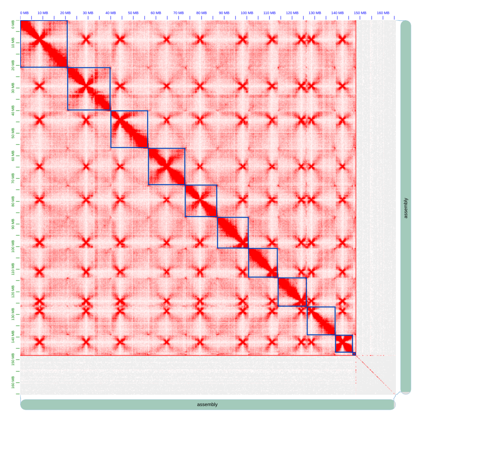

# Genome Assembly — *Golovinomyces cichoracearum* BFJ

The nuclear genome of *G. cichoracearum* isolate BFJ was assembled from PacBio HiFi long reads and validated with Hi-C chromatin conformation capture data. The assembly spans 166.49 Mb in 459 contigs with a contig N50 of 14.2 Mb. The eleven largest contigs correspond to the eleven chromosomes and account for the bulk of the genome; nine of the eleven chromosomes are assembled from telomere to telomere.

| Assembly metric | Value |
|---|---|
| Total length | 166.49 Mb |
| Number of contigs | 459 |
| Number of chromosomes | 11 |
| Contig N50 | 14.2 Mb |
| L50 | 5 |
| Longest contig (Chr1) | 21.05 Mb |
| GC content | 41.59% |
| Consensus quality (QV) | 47.18 |
| K-mer completeness | 99.29% |
| BUSCO (Ascomycota, genome mode) | 96.9% complete |

## Hi-C contact map

The Hi-C interaction map (MboI digestion, 3 sequencing lanes) confirms eleven discrete chromosomal interaction blocks, consistent with the eleven largest contigs being complete chromosomes. YaHS scaffolding introduced **zero additional joins** — the contigs had already assembled to chromosome scale from HiFi data alone.

*Figure: Hi-C chromatin interaction map of the eleven *G. cichoracearum* BFJ chromosomes. Each bright square along the diagonal corresponds to a single chromosome; the absence of strong off-diagonal signal confirms correct chromosome-scale organisation.*

## Chromosome structure

| Chromosome | Length (Mb) | Left telomere | Right telomere | Status |
|---|---|---|---|---|
| Chr1 | 21.05 | + | + | T2T |
| Chr2 | 19.19 | + | + | T2T |
| Chr3 | 16.47 | – | + | Partial |
| Chr4 | 16.21 | + | + | T2T |
| Chr5 | 14.20 | + | + | T2T |
| Chr6 | 13.70 | + | + | T2T |
| Chr7 | 13.01 | + | + | T2T |
| Chr8 | 12.76 | + | + | T2T |
| Chr9 | 12.47 | + | + | T2T |
| Chr10 | 7.80 | + | + | T2T |
| Chr11 | 1.17 | – | + | Partial |

Chromosomes are numbered by decreasing length (Chr1–Chr11). Telomeres were detected by searching the terminal 200 bp of each chromosome for tandem arrays of the canonical fungal telomere repeat (CCCTAA/TTAGGG).

## Pipeline overview

The assembly pipeline consists of six steps:

| Step | Script | Description |
|---|---|---|
| 1 | `01.hifiasm.sh` | De novo assembly from 5 PacBio Revio SMRT cells (10.3 Gb HiFi reads, ~62× coverage) |
| 2 | `02.hic_align.sh` | Hi-C read alignment with bwa-mem2 `-5SP` mode (3 lanes, MboI-digested) |
| 3 | `03.yahs_scaffold.sh` | YaHS scaffolding with telomere motif detection |
| 4 | `04.hic_heatmap.sh` | Juicebox .hic file generation and Hi-C contact map visualisation |
| 5 | `05.assembly_stats.sh` | Assembly statistics (N50, QV, BUSCO, mapping rates) |
| 6 | `06.contig_rename.sh` | Rename top 11 contigs to Chr1–Chr11 by decreasing length |

### Key strategic decisions

- **No Hi-C phasing in hifiasm** — the genome is haploid with 0% detectable heterozygosity; no haplotypes to phase.
- **YaHS with `--telo-motif GGGTTA`** — detects telomeric repeats at scaffold ends during scaffolding, providing both scaffold joins and telomere status in a single run.
- **bwa-mem2 over bwa** — 2–3× faster alignment speed for Hi-C reads with identical accuracy.
- **Contigs were already chromosome-scale** — Hi-C scaffolding validated the assembly but introduced no additional joins. This is an unusual and positive outcome indicating that the HiFi read length and coverage were sufficient to span repetitive regions and resolve chromosome structure directly.

## Data access

The genome assembly is deposited at the European Nucleotide Archive (ENA) under accession **GCA_984789755** (contig range CFJKNU010000001–CFJKNU010000459), linked to BioProject **PRJEB114362**. Raw sequencing reads are available under run accessions ERR17368092–ERR17368094 (HiFi), ERR17368089–ERR17368091 (Hi-C).

## Software versions

| Tool | Version | Reference |
|---|---|---|
| hifiasm | v0.25.0 | Cheng et al., *Nat. Methods* 18, 170–175 (2021) |
| bwa-mem2 | v2.2.1 | Vasimuddin et al., *IPDPS* (2019) |
| YaHS | v1.2.2 | Zhou et al., *Bioinformatics* 39, btac808 (2023) |
| samtools | v1.22.1 | Danecek et al., *GigaScience* 10, giab008 (2021) |
| juicer_tools | v1.22.01 | Durand et al., *Cell Syst.* 3, 95–98 (2016) |
| BUSCO | v5.6.1 | Manni et al., *Mol. Biol. Evol.* 38, 4647–4654 (2021) |
| Merqury | v1.4.1 | Rhie et al., *Genome Biol.* 21, 245 (2020) |
| seqkit | v2.9.0 | Shen et al., *iMeta* 3, e181 (2024) |

## References

1. Cheng, H. et al. Haplotype-resolved de novo assembly using phased assembly graphs with hifiasm. *Nature Methods* 18, 170–175 (2021).
2. Zhou, C., McCarthy, S. A. & Durbin, R. YaHS: yet another Hi-C scaffolding tool. *Bioinformatics* 39, btac808 (2023).
3. Durand, N. C. et al. Juicer provides a one-click system for analyzing loop-resolution Hi-C experiments. *Cell Systems* 3, 95–98 (2016).
